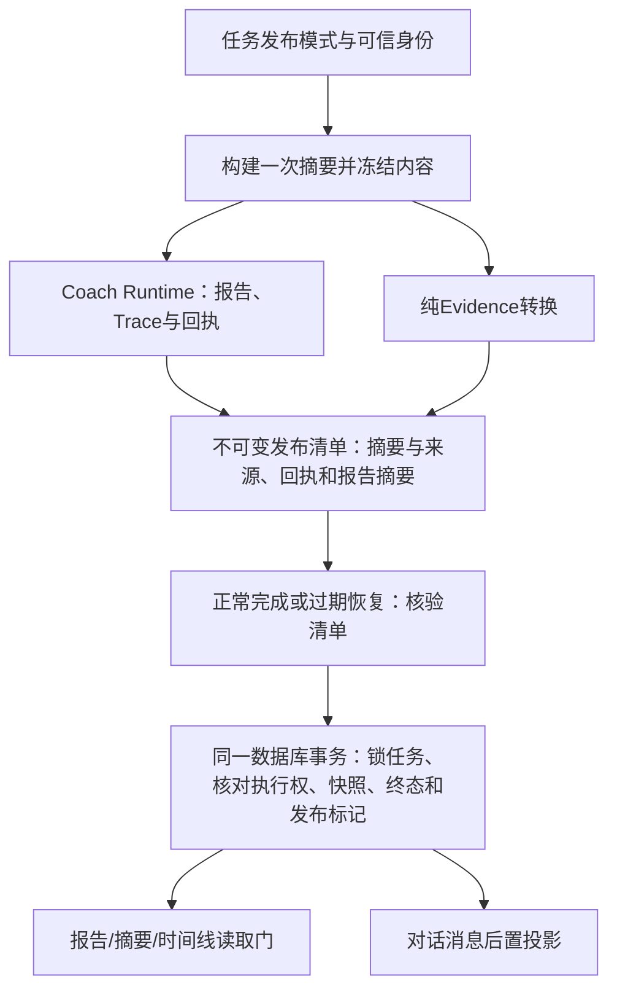

# ADR-0099：同源Evidence约束的任务发布

状态：A completed locally（RQ-256，2026-09-07），待同SHA公共CI；B/C仍为Accepted design，尚未实施。不启用生产默认，原RQ-255设计见下文，实际证据见末节。

## 背景与要求

RQ-254已有纯Summary→Evidence转换，但应用报告、SQL任务终态和Evidence快照尚未联接。当前`PostgresTaskRepository.succeed()`通过`_terminal_cas()`在任务行锁内核对worker、lease generation/token、expiry和取消状态；`reconcile_expired_success()`独立处理过期lease。`PostgresEvidenceSnapshotRepository.append()`自行开启事务，只核对owner/task/run及任务状态。把两个公开方法串起来不能保证同时提交。

具体失败场景：先append后succeed会让已失权的执行者留下快照；先succeed后append会让报告可读但快照未落库；仅在Worker加检查会被基于旧文件回执的恢复路径绕过。要求发布和恢复均满足同源身份、执行权和事务原子性，外部数据与模型调用不进入数据库锁区间。

## 决定

保留现有Runtime、数据库和旧任务行为，增加显式`evidence_bound_v1`发布模式。模式由可信任务创建端决定，创建时持久化，不能由请求正文或文件是否存在推断。旧行默认legacy，旧指纹字节不变；新模式纳入新指纹域，同一幂等键不同模式必须冲突。模式字段进入ReviewTask内部读取/恢复合同，不以新增默认字段重写旧公开JSON。

1. 应用在`RecentReviewApplicationService._review_from_summary()`内冻结一次完整JSON摘要，分别交给原编译器和纯桥；检验交付前后摘要一致。禁止共享builder的last_result或再取一次数据。来源快照与观测时刻由显式依赖提供，读取缺失必须保留真实缺口。
2. 新增独立版本化发布清单，不改写`ApiRunReceipt@1.0`。清单绑定owner/task/run、request_fingerprint、发布模式、summary_digest、bundle摘要及可重建的允许字段快照、receipt/trace/artifact引用和摘要。不保存lease token、玩家正文或Memory；失败码不携带原异常正文。清单为本地私有工件，文件创建采用不可覆盖/摘要校验；文件落盘不构成产品发布。
3. 新任务标记确保缺清单时不能退回legacy。清单在模型/报告完成后、SQL提交前持久化；先写bundle工件，再写引用它的完整清单。只写一半、回执不匹配、摘要篡改或缺文件时拒绝发布；运行已产生副作用时进入既有recovery_required边界，不能重新调用模型来修补证据。
4. 正常完成、手工对账和过期恢复在锁内调用同一个内部发布校验/写入过程。快照插入提取为接收已有Session及已锁定任务的内部函数，保留大小上限262144字节、幂等digest冲突、revision、时间和严格投影校验；绝不在任务事务里调用另开session的公开append。任何快照、终态或生命周期事件写入失败，整个事务回滚。
5. 正常入口保留live lease条件，恢复入口保留expired lease条件，均保留cancel/run检查并新增owner/模式/指纹/清单身份检查。任务SQL发布标记记录清单摘要、首次快照ID/摘要、summary_digest及receipt摘要；与快照、终态及事件同时提交。恢复不靠“本地报告存在”判定成功。
6. 用户报告、recent-summary、timeline入口保留既有SQL状态/owner门，并在显式模式下核对发布标记和对应首次快照。最新刷新快照不能替换首次发布绑定；Evidence展示可继续按既有latest/expiry规则展示刷新或过期。缺失/损坏绑定返回稳定完整性错误，不回退读本地报告。

## 发布语义和恢复矩阵

| 条件 | 结果 |
| --- | --- |
| Runtime完成，证据完整或合理degraded | 事务提交快照、任务终态和发布标记；来源缺口保持可见，质量门不变 |
| Runtime质量拒绝但有有效Summary/bundle | 同事务记录证据与拒绝终态，report_available=false；不生成报告消息 |
| Runtime失败、无有效Summary或清单损坏 | 不进入证据绑定成功提交；沿用安全失败/恢复流程 |
| 取消、旧worker、旧generation/token或正常入口lease过期 | 返回失权/取消，零快照/终态/消息写入；本地诊断工件可存在 |
| 数据库中途失败 | 整体回滚；恢复仅消费已验证清单，不重做外部调用 |
| 提交成功但响应丢失 | 先读取已提交身份并比对清单/首次快照/终态；一致即确认既有结果，不追加revision/事件；不同则冲突 |
| 提交后消息写入失败 | 任务和快照仍已提交；消息按既有source_task/run幂等规则补投，不能宣称SQL回滚 |

消息属于后置投影，当前`terminal_turn_writer.write()`有自己的事务，其Memory候选仓库又可能独立开启事务。此次不把这些事务假装合并。显式模式需在同一终态事务记下可恢复的projection-needed标记；成功消息投影后确认完成，崩溃时可按标记重放，沿用既有唯一约束。只支持当前candidate_proposals=()的教练终态消息；不扩展Memory候选跨事务原子性。补投不重复模型或工具调用，也不改变已发布报告。

## 替代方案与代价

先写快照/先写终态的两段提交都留有窗口；单靠Worker内存检查不能覆盖恢复；新增消息系统/通用事务框架会扩大维护面。因此选择现有PostgreSQL事务和小型持久发布标记。代价是增加任务字段/迁移、版本化本地清单、双路径与查询门回归，以及有限的消息补投状态。收益是可用数据库回滚和并发测试直接证明发布约束。文件系统与数据库不构成分布式事务，残留未发布工件由既有生命周期处理；不可承诺磁盘损坏时报告依然可用。

## 实施顺序与明确验收

原设计下一批仅A：离线实现版本化发布清单与同源应用交付，建立可恢复工件；现A已本地完成，下一步同SHA公共CI，B/C留在后续明确检查点。先验证应用交付合同，再改持久化事务。

### A：同源应用交付与发布清单（RQ-256本地已完成）

- 新增`app/evidence/publication.py`、`app/evidence/publication_store.py`及`tests/test_evidence_publication.py`、`tests/test_evidence_publication_store.py`。
- 修改`app/product/recent_review_service.py`、`app/product/coach_composition.py`和`tests/test_coach_application_composition.py`：新增默认关闭、成对注入的来源/清单依赖和可信发布上下文；旧调用签名和返回合同保持兼容，显式调用可产出新工件。创建依赖不得发网络，应用仅消费已物化来源。
- 清单必须包括任务身份上下文与模式；A阶段只验证传入身份，不能声称已由数据库授权。复用`summary_bridge.py`及`storage.py`的bundle严格序列化/反序列化，不再写第二套融合逻辑。
- Fake Provider验证review/review_by_puuid均只取一次Summary；摘要/回执/Trace/报告完全匹配；两次同内容写入可重放，不同内容拒绝；路径逃逸、截断、bundle/清单篡改、跨owner/run、输入并发修改检测、来源缺口、质量拒绝与模型失败均有针对性测试。
- 接口只返回/存储待发布工件，不调用数据库、不自动启用Worker，明确files-ready与published不同。可信上下文缺失时显式模式失败，legacy路径不生成清单。
- 验证：`python -m pytest tests/test_evidence_publication.py tests/test_evidence_publication_store.py tests/test_coach_application_composition.py tests/test_evidence_summary_bridge.py tests/test_recent_review_application_service.py -q`；编译所改模块、治理和diff检查。预期全部通过，尚无实际测试结果。

### B：持久模式、事务与恢复（A闭环后的批次）

- 涉及`app/tasks/models.py`、`ports.py`、`fingerprint.py`、`service.py`、`recent_review_executor.py`、`reconciliation.py`，以及`app/persistence/task_record.py`、`task_repository.py`、`evidence_snapshot_repository.py`、`app/workers/review_worker.py`。
- 规划迁移`migrations/versions/0012_evidence_bound_publication.py`，实现时先确认实际head和文件占用；增量默认legacy，迁移不读取或修改旧报告/回执。新增mode、publication reference及message projection状态；提交身份必须来自锁定任务。
- 先抽session内快照过程并回归旧append；再让succeed、reconcile_expired_success与手工reconciliation消费同一发布清单合同。显式模式缺失必须拒绝，不能通过可选参数None降级。
- 对真实本地PostgreSQL测试并发旧lease、新generation、cancel竞态、快照插入后故障、事件故障、提交响应丢失与重放，断言snapshot/terminal/event同增同回滚。单纯mock不能证明事务。迁移、旧任务/旧指纹/旧恢复全部保持兼容。

### C：读取门、消息补投与显式装配（B闭环后的批次）

- 涉及`app/api/main.py`、`app/api/composition.py`、`app/workers/composition.py`、`app/persistence/terminal_turn_writer.py`及相关查询/恢复服务。
- 既有report/summary/timeline入口共用绑定校验；使用快照首次发布身份，最新Evidence刷新不重写首次绑定。跨owner、快照丢失/损坏与旧legacy兼容均验证。
- 后置消息故障重试只重放已提交报告，source_task/run唯一约束防重复；标记确认失败也可安全再试。普通生产模式继续保持原默认。
- 相关实际测试入口包括`tests/test_reliable_task_repository_postgres.py`、`tests/test_reliable_task_recovery_postgres.py`、`tests/test_task_reconciliation_postgres.py`、`tests/test_evidence_snapshot_repository_postgres.py`、`tests/test_terminal_turn_writer_postgres.py`；实现后新增显式模式用例，不将现有通过数当新行为证据。

## RQ-255历史设计验证与八维学习

问题/原理：同源证据与数据库事务原子性；设计/实现取舍见决定和替代方案；代码地图与控制流见图及A/B/C；验证见恢复矩阵和分批验收；运行手册为先A本地实现/公共验证，再按canonical进入B/C；失败/安全边界见矩阵、身份和查询门；面试可说“设计了证据与任务终态的同事务发布及恢复约束”，不能说已经上线或完成真实数据验证。

本次只有文档，源码事实由主代理核对应用/回执/查询门，Luna只读核对SQL/Worker/恢复接口后由主代理审查。主代理确认API已有SQL状态门，因此新增绑定检查用于显式模式一致性校验；并非当前API会无条件提前读取报告。未跑产品测试，治理/diff通过后收口。学习材料已提供，所有者理解未新增确认；参考来源仅本地源码、无新在线审计；本地与公共实现仍为RQ-254（045fd05 / Actions34096446523），无新部署。Stage8/8E仍in_progress、production_media=0，真实API=0。

## RQ-256 A实施记录与八维学习（2026-09-07）

1. 问题：模型/报告完成不代表证据可恢复，更不代表任务事务已发布；用files_ready清单明确离线交付边界。
2. 原理：完整Summary规范JSON摘要与实际输入文件字节摘要分别保留；恢复时重建typed EvidenceBundle，再从已验证输入重跑纯桥，比较整个投影，防止只修改bundle并重算其摘要。哈希是完整性约束，不是来源真实性签名。
3. 设计：EvidencePublicationContext使用既有OwnerId字符合同、UUID task、规范run和SHA指纹；Sources只持有已物化来源/时间。来源和writer成对注入，显式上下文缺失/错run/Memory错owner均在builder前失败；默认路径不产生sidecar。A只核对可信调用者传入身份，数据库授权仍属于B。
4. 代码地图：publication.py定义严格版本化清单/来源/写入端口；publication_store.py复用RunQueryService内部校验链，检查回执、Trace、报告和已验证输入，不复制第二套运行真相算法。这是有意的包内耦合，未来调整查询校验时必须保留这些聚焦回归。recent_review_service.py在同一次Summary返回后做独立深拷贝，先转换，完成Runtime并写回执后交付；coach_composition.py只转发显式依赖，不改返回DTO。
5. 测试：完整聚焦集152 passed、4 skipped；最后新增Provider异常语义专项1 passed，合计153通过/4跳过。新增60用例中56通过；4个实际符号链接用例受Windows权限限制，另4个模拟OS链接检测分支读写拒绝均通过。覆盖双入口、默认兼容、源快照重建/缺口、观测时刻、跨owner/task/run/指纹、字节截断/删除、语义bundle替换、同内容重放/冲突、编译输入突变、中断写入及Runtime失败。不把合成fixture称作真实来源；未运行数据库或真实API。
6. 操作：使用既有runs_root创建FileEvidencePublicationStore，并与EvidencePublicationSources成对传入build_coach_application；review/review_by_puuid传publication_context和同一run_id。store.read(context)验证恢复，store.write(context, projection)只重放同内容工件；不得通过重新调用review来修复文件（旧运行/回执本身不可覆盖）。先evidence_bundle.json、后evidence_publication_manifest.json；缺清单或损坏不能算完整。当前无数据库/Worker消费者，下一步仅公共CI。
7. 失败边界：质量拒绝且Summary有效可有清单，但report=None；模型chat异常沿用既有completed/rejected + draft_preparation_failed语义。Runtime FAILED只留既有失败回执，不生成证据清单。路径拒绝越界/符号链接/解析别名，写入使用同目录临时文件、fsync和create-if-absent硬链接，临时文件finally清理。错误在handler外转安全码，不保留原错误正文。写入后和读取时复核依赖，但不承诺抵御拥有同机目录写权限的持续竞争攻击或断电后的跨文件事务原子性；B仍须核对可信持久摘要及事务身份。
8. 面试表述：可说“实现了同源输入约束的可重放离线发布清单并验证失败路径”，不能说已完成数据库事务发布、真实数据验证或上线。

Luna因额度限制仅留下草稿，主代理重写合同/存储薄弱处并完成接线及审查；未测量或宣称额度节省。所有者理解未新增确认；参考来源审计无新增；公共证据仍RQ-254，无新部署，8E in_progress、production_media=0。所改模块编译、治理、diff检查通过。首次治理指出三处机器checkpoint镜像未同步，已修正canonical“唯一下一步”和活动计划Current Phase/Next Step后复检通过，未放宽规则。
