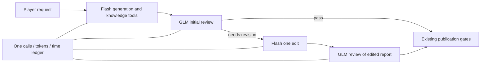

# ADR0109: Proposed reviewer roles under one Coach task budget

2026-09-23. Status: **proposed, offline prototype verified; not adopted**.
Product remains GLM-5.3-flash/high. No new live batch or admission is authorized
by this record. This decision concerns product models, unrelated to Codex Luna.

## Problem and evidence

The Agent must turn a player request into a sourced report, detect material
errors, edit once and review the edited report before publication. Repeated Flash
review failures prevented this loop. ADR0108's explicit-ID GLM-5.3/high diagnostic
correctly rejected the original attribution error and accepted the correct full
report, including all emitted source references. These are two development
controls, not stable accuracy, an actual edit or qualification across15 inputs.

The proposed change assigns this review work to the model with the new positive
evidence, retaining Flash for generation, tools and editing. It does not loosen
full-context acceptance or move truth checking to deterministic phrase rules.

## Concrete contract proposal

| Role | Exact model/profile | Input/output and failure behavior |
|---|---|---|
| Generation and tool rounds | glm-5.3-flash / glm-5.3-flash-candidate-enabled-high-replay | Existing AgentLoop and knowledge tools; actual full context; Markdown draft |
| Initial, corrective and final review | glm-5.3 / glm-5.3-review-diagnostic-high-replay | Existing partitioned tool result; explicit source IDs; issues block and advisories remain nonblocking |
| One revision | Same Flash/high as generation | Accepted original findings and same source context; complete edited Markdown; no advisory promotion |

Reuse `NativeBusinessReviewWorkflow` for evaluation order, original bad opinion,
explicit reassessment mappings, revision identity and final-report/source binding.
Apply the reversible explicit-source projection to every review and edit input.
Retain complete response/receipt identities; never shift returned IDs or discard
invalid findings. Final review must inspect the real edited report, not the frozen
correct control. Unknown/conflicting role metadata and wrong model/profile fail.

One existing `CoachBudgetedProvider` algorithm owns **5 calls,401920 tokens,900s**,
with per-request **64000 input ceiling,32768 output,300s**, zero SDK retry and one
revision. Ordinary two-round generation + initial review + edit + final review
uses all5 calls. Recovery can leave insufficient room; reject, never open another
ledger. Time remaining clamps every request, including calls to the other model.

## Implemented preparation and exact boundary

`scripts/reviewer_role_proposal.py` implements the dispatch and projected review
workflow without a live entry point or credentials. `coach_budget.py` has one
protected delegate-selection seam; the ordinary single-provider path is unchanged.
The proposal deliberately has a composite identity rejected by the existing
single-model product contract. It is **not** injected into the default app.

`tests/test_reviewer_role_proposal.py` first runs the existing application with
scripted responses to capture actual generation/tool messages and five retrieved
knowledge citations. It then feeds those compiled requests and actual review
inputs through two separately identified scripted providers and the shared
budget/state machine. Both normal completion and recovery exhaustion pass.
Other checks cover incorrect model/profile, missing projection, conflicting
phases, transport exception, bad/missing receipt, pre-call deadline, late response
and token exhaustion. Receipt failure retains already observed usage. No network
is permitted in these tests. This is an offline composition check, **not** proof
that default product observation/storage/publication supports multiple models.

91 relevant tests pass, including existing single-model composition, runtime
observations, recorder, native sender and product budgets. No frozen production
component fingerprint changed; actual native application construction also passed.

## Required integration before live qualification or product consumption

| Existing component | Necessary change and completion evidence |
|---|---|
| Coach contract and runtime factory | New opt-in role descriptor binds both profiles, source projection, policies and transports. All phases receive one budget object. Preserve default selection until admitted. |
| Observed provider | Record the selected model for each request under one global call ordinal; two observers with independent counters are insufficient. Verify start/completion/failure identities together. |
| Recorder and pricing | Existing recorder prices the whole run using one model. Add explicit per-model pricing under the role descriptor; retain start/completion identity checks. Mixed runs cannot be priced as Flash; unknown usage stays unknown. |
| Receipted provider factory | Run-scoped transports for each model, distinct raw paths and task-global call bindings. Actual model/profile/transport/request SHA must agree; preserve malformed response usage and process deadline. |
| Composition and fingerprints | Register the chosen workflow and explicit source projection in the candidate manifest, update affected hashes and derived digest together; test actual assembly, not only injected factories. |
| Qualification and product entry | Replace dormant a71eb94 five-control binding with the exact new role/workflow/transport identity and original15 varied inputs. Old successful cases or the two ADR0108 reviews cannot grant admission. |
| Consumer path | Once qualified, verify actual generation/edit/final review, Evidence persistence and existing Worker/DB/API/Workbench consumption. No new parallel product stack. |

All six integration areas arise from the traced current code. Implement them as
one role-composition change after adoption, with regression at shared boundaries;
do not run a paid test after each individual wiring edit. Existing raw diagnostic
batches remain closed. New real requests require a prepared, separately bounded
plan and exact clean-HEAD public checks.

## Alternatives, costs and remaining uncertainty

- Keep all roles on Flash: least integration effort, but repeated full-report
  semantic failures are unresolved; another wording permutation is not justified.
- Assign every role to full GLM: no current evidence generation/editing needs that
  change; larger model cost and a wider behavioral change to validate.
- Proposed limited role assignment: positive evidence for the changed task and
  reuse of the current Agent; costs include two transport identities, role-aware
  observation/pricing and requalification. It may still fail on editing or other
  inputs. Two successful reviews do not guarantee success.

Official pricing snapshot from ADR0108 lists uncached input/output per million
tokens: Flash0.8/2.8CNY, GLM8/28CNY. For the ordinary3Flash+2GLM path, conservatively
reserving64000 input +32768 output **per call** gives3.2878592CNY. This deliberately
overestimates the joint401920-token envelope; it is a planning estimate, not a
bill, spending authorization or guarantee for other recovery paths. Cached input
is included in input tokens, never added again. Actual latency of the two GLM
diagnostics was48.062/28.235s, not a whole-task latency prediction.

## Adoption decision and next verification

The reviewable decision is whether to implement this **opt-in candidate role
composition**. It does not select a production default, grant qualification,
increase the task budget or authorize further paid requests. This boundary comes
from the user's explicit Flash product selection and narrowly completed two-call
diagnostic approval, recorded in requirements_change_log and ADR0108.

If adopted, complete the integration table and offline default/candidate/failure
checks first. Then prepare bounded real validation using the original wrong and
correct reports, actual Flash revision and GLM final review; retain the original15
coverage requirements and independently audit every finding, source and changed
paragraph. Stop at the first substantive failure and diagnose that earliest
divergence. Quality success unlocks consumption; it does not complete8E by itself.

Coach/Review/Training/Evidence linkage, personalized plans, frontend aesthetics,
necessary redesign and champion avatars, Memory/RAG, identity/operations,
two-checkout integration, independent holdout and learning stay tracked in the
active plan and restart plan. This proposal neither drops nor reorders them.
