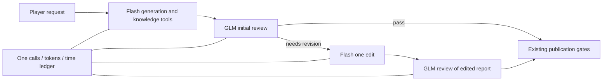

# ADR0109: Adopted reviewer roles under one Coach task budget

2026-09-23. Status: **adopted for opt-in candidate integration; live quality and production admission pending**.
Default product remains GLM-5.3-flash/high until qualification. The user adopted
the role proposal on 2026-09-23 (requirements_change_log); no completed diagnostic
batch is reopened and no production admission is granted by this record. This decision concerns product models, unrelated to Codex Luna.

## 2026-09-24: current 1.5.2 state

Latest same-identity prospective evidence:34648531 / CI35967784437 completed
three cases with all7 stages accepted after primary/independent source checks:
correct95/pass; universal error80 -> real Flash edit ->95/pass; attribution
error84 -> real edit ->96/pass. No ancillary-error exception or reassessment
was used.104967tokens, unknown0, uncached estimateCNY0.970882, not invoice.
ADR0111 and golden_role_task_result_v1.json preserve the full evidence. Strict
offline qualification of these raw receipts plus the remaining original12 is
the next action; neither task outcomes nor this paragraph grant qualification.
The following prior failed batch remains unchanged historical evidence.

Role contract1.5.2 / Program3.1.2 / evaluation3.5.0 retains only nonblocking
paragraph markers. On88f05647 / CI35960739920, the correct frozen report passed
95 with full host acceptance. The next explicit error was correctly detected,
but the review explanation added the false middle-vision range27–43 instead of
25–43. The batch stopped before editing:2requests/29576tokens, unknown0,
uncached estimateCNY0.355568, not invoice. Current qualification is1accepted,
1failed,13unrun. ADR0110 records an unchanged-fixture two-call containment
observation. That tail subsequently completed on465e3fd8 with a correct actual
edit and95/pass fresh review, accepted by primary/independent source checks:
2new calls/25693tokens, unknown0, uncached estimateCNY0.1510924. It does not
overturn the failed review or grant original15/product admission. ADR0110 and
the task-outcome qualification design keep these evidence levels separate.

## 2026-09-24: earlier 1.5.1 evidence, not production admission

The current opt-in role contract is1.5.1 (Program3.1.1 / evaluation3.4.0);
ADR0110 records the prospective removal of unused advisory replacement text.
On6a5afe9c / CI35903747333, attribution:1 completed actual GLM review,
Flash revision and GLM final review (96/pass), accepted after full host and
independent review. The subsequent frozen correct claim-scope:1 received a
false-positive needs_revision and omitted severity; no recovery was sent.
The closed batch used4requests/68811tokens, unknown usage0, estimated uncached
cost0.865566CNY (not a bill). Original15 coverage is1accepted/1failed/13not run;
the composition remains unqualified. Full source/receipt audit and the host's
invalid rejection-hash terminal error are preserved in
`golden_role_note_qualification_pair_result_v1.json` and ADR0110.

This is evidence of one ordinary corrective chain, not independent editing
after pass, reliable false-positive correction or real Worker/DB/UI consumption.
The findings below retain their historical versions; they do not reset the
latest action to the original integration or reopen completed batches.

## 2026-09-23: approved live integration observation completed

On clean `346213c` / CI `35814004366`, the user-approved two-batch plan used
five calls in total. Both identical-input Flash controls were accepted by the
host: the original attribution error received 84/needs_revision; the corrected
complete report received 95/pass with four supported, nonblocking advisories.
These paired observations do **not** demonstrate that GLM outperforms Flash.
The adopted composition remains a candidate; no performance ranking is inferred.

The actual application used two Flash generation calls, three real local
knowledge searches and one GLM review. The original GLM response was 96/pass,
and the development application wrote its report/Evidence files successfully.
Report bytes, complete review input, file publication readback and per-model
Trace/receipt accounting were verified. No revision occurred; populated Memory,
Worker/DB/API/Workbench consumption and original-15 qualification are unproven.

Independent host review rejects the report's block27 knowledge-retrieval date:
it says 2026-09-10, while K1-K5 supply only document updated_at=2026-07-23 and
the actual uncached searches occurred on 2026-09-23. The raw pass/published
receipts remain unchanged. This is an unsupported source-time claim missed by
review, not transport failure or exhausted output/time budgets. The generation
and review inputs preserved the supplied knowledge metadata; actual query time
exists in the Trace but is not provided as knowledge provenance to the models.
Neither an internal model cause nor the sufficiency of adding metadata is proven.

The two tasks used 68,471 tokens with zero unknown-usage calls and an all-input
uncached estimate of CNY0.2303468 (not a vendor bill). No new paid retry followed.
Original responses, source audit, private-field-safe public projections and a
host-only minimal reference edit are in `golden_flash_source_pair_result_346213c.json`
and `golden_role_application_result_346213c.json` under `data/evaluation/results/`.
The reference is not a model revision or qualification result. Diagnosis and the
next work package are in `docs/plans/2026-09-23-role-live-evidence-and-knowledge-time.md`.

## 2026-09-23: knowledge-time controls do not qualify the reviewer

The time-provenance controls are complete and closed. On 883c23e, GLM detected
the unsupported date but cited knowledge rows without the retrieval-time basis.
On 6c3a3db / CI35835943718, those rows contained the corresponding actual times,
yet GLM returned 95/pass and missed the same report error. A nonblocking advisory
also selected CS sources for an otherwise correct early-deaths comparison.
The host rejected both first cases; neither second case was sent. Full responses
and separate host decisions remain under golden_knowledge_time_result_883c23e.json
and golden_knowledge_time_citation_result_6c3a3db.json. This is no evidence of
stable review, model superiority or a completed revision loop.

The source propagation fix remains useful, but is not a sufficient semantic fix.
No default/model/budget/acceptance change follows from these results. The linked
diagnosis now requires a method-level responsibility check before another paid
experiment; an extra review call cannot silently exceed the five-call task.

## Problem and evidence

### 2026-09-24: source propagation verified; advisory output responsibility narrowed

On 6c100a25 / CI35896981340, the bounded application completed three calls in
213.718s. The complete generated report passed independent host inspection;
attributable OP.GG metadata and local knowledge provenance survived generation,
review and file readback. GLM returned93/pass, but one optional note cited only
CS/gold roots while adding damage figures. Report acceptance and incomplete
review-output support remain separate; no real revision occurred. Public
evidence is golden_role_source_metadata_result_v1.json. This is not original15
qualification or proof of a generic recall fix.

The current opt-in role contract is1.5.1 / Program3.1.1 / evaluation3.4.0. It
retains nonblocking advisories but requires only block, source_ids and
explanation. No product consumer uses their former mandatory replacement prose;
real issues still require suggested_correction and follow the same edit gate.
The previous RoleReviewWorkflow remains unchanged for historical replay.
Old traces retain their exact trusted1.5.0 identity for readback only; old
responses are not stripped into new valid outputs. Source mappings, model
roles, shared budget and full-context acceptance are unchanged. The leaner
contract has offline evidence only, not live quality or production admission.
Decision, alternatives and limitations are in ADR0110.

The Agent must turn a player request into a sourced report, detect material
errors, edit once and review the edited report before publication. Repeated Flash
review failures prevented this loop. ADR0108's explicit-ID GLM-5.3/high diagnostic
correctly rejected the original attribution error and accepted the correct full
report, including all emitted source references. These are two development
controls, not stable accuracy, an actual edit or qualification across15 inputs.

The adopted change assigns this review work to the model with the new positive
evidence, retaining Flash for generation, tools and editing. It does not loosen
full-context acceptance or move truth checking to deterministic phrase rules.

## Concrete contract proposal

| Role | Exact model/profile | Input/output and failure behavior |
|---|---|---|
| Generation and tool rounds | glm-5.3-flash / glm-5.3-flash-candidate-enabled-high-replay | Existing AgentLoop and knowledge tools; actual full context; Markdown draft |
| Initial, corrective and final review | glm-5.3 / glm-5.3-review-diagnostic-high-replay | Existing partitioned tool result; explicit source IDs; issues block and advisories remain nonblocking |
| One revision | Same Flash/high as generation | Accepted original findings and same source context; complete edited Markdown; no advisory promotion |

Reuse `NativeBusinessReviewWorkflow` for evaluation order, original bad opinion,
explicit reassessment mappings, revision identity and final-report/source binding.
Apply the reversible explicit-source projection to every review and edit input.
Retain complete response/receipt identities; never shift returned IDs or discard
invalid findings. Final review must inspect the real edited report, not the frozen
correct control. Unknown/conflicting role metadata and wrong model/profile fail.

One existing `CoachBudgetedProvider` algorithm owns **5 calls,401920 tokens,900s**,
with per-request **64000 input ceiling,32768 output,300s**, zero SDK retry and one
revision. Ordinary two-round generation + initial review + edit + final review
uses all5 calls. Recovery can leave insufficient room; reject, never open another
ledger. Time remaining clamps every request, including calls to the other model.

## Implemented opt-in integration and exact boundary

The initial offline proposal remains as historical evidence. The adopted path is
now `build_role_coach_application` with `ROLE_COACH_CONTRACT` (1.5.0), the
`flash_glm_review_v1` assets (Skill0.6.1 / Program3.1.0 / evaluation3.3.0), and
`RoleReviewWorkflow`. It reuses the actual Agent generation/tools, Memory/RAG,
Harness review/revision and existing Evidence publication path. The default
single-model composition is unchanged; neither path acquires quality admission.

One budget wraps one observed router and two run-scoped receipted transports.
Every request has a task-global ordinal, selected model/profile/transport and
request SHA. Runtime traces record and price each actual model; only the exact
trusted role-contract snapshot permits mixed identities. Raw call bindings use
create-only global ordinals and distinct generation/review directories. Complete
responses with failed receipts retain observed usage but cannot publish; unknown
usage remains unknown, and failures stop the same task. A stopped budget does
not expose the preceding successful Exchange as the current result.

Candidate fingerprints bind the actual projected policies, validator, source
projection, router, observation, accounting, transports and shared application.
The original15 distinct controls, including the three completed by older
versions, must all be qualified afresh. The dormant product entry no longer
uses the old a71eb94 five-control evidence. No historical success, scalar count
or scripted result grants admission to this composition.

Offline application checks exercise normal five-call publication, recovery
exhausting the final-review budget, wrong model/transport/receipt failures,
observed-player Memory identity, Evidence files and persisted per-model usage.
They verify engineering behavior, not the real models' semantic quality. The
observation fixture's clock was corrected to follow its source timestamp;
production source-date validation was not weakened. Final verification is
recorded in the active progress log rather than a second rolling test count.

The executable development preparation is under
`data/evaluation/results/role_flash_glm_review_preflight_20260923_v1/`.
`next-batches.json` binds the Flash pair and the actual application preview,
including run ID `role-development-20260923-v1`, fixed source time
`2026-09-23T11:09:57+08:00`, the original first request and
preparation SHA `4fe0e123f3993502f82e019e96bfdda959131303a010477fcef67820f7b243ed`.
`scripts.run_flash_source_review_pair` and
`scripts.run_role_coach_development` support credential-free preview and bounded
execution after an approved plan and clean exact-HEAD public checks. The latter
reuses the real application, not a prewritten report. If initial review passes,
`revision_exercised=false`; this does not prove live revision. Receipt accounting
failure marks the whole observation failed even if a report already exists.
Local original-source preview still depends on frozen data/runs; CI uses committed
fixtures. Neither preview nor this decision authorizes new paid calls.

The next real batch must use this concrete bounded plan and clean exact-HEAD public
checks. Completed diagnostic batches remain closed. Same-input Flash controls
separate model choice from explicit-ID representation; a real mixed Agent run
must inspect its generated and, if needed, actually revised report. A complete
mixed task and the original15 qualification are still unproven. Consumer/DB/API/
Workbench evidence follows qualification using the existing product stack.

## Alternatives, costs and remaining uncertainty

- Keep all roles on Flash: least integration effort, but repeated full-report
  semantic failures are unresolved; another wording permutation is not justified.
- Assign every role to full GLM: no current evidence generation/editing needs that
  change; larger model cost and a wider behavioral change to validate.
- Proposed limited role assignment: positive evidence for the changed task and
  reuse of the current Agent; costs include two transport identities, role-aware
  observation/pricing and requalification. It may still fail on editing or other
  inputs. Two successful reviews do not guarantee success.

ADR0108's 2026-09-22 pricing snapshot lists uncached input/output per million
tokens: Flash0.8/2.8CNY, GLM8/28CNY. The ordinary3Flash+2GLM path previously had a
per-call-full-reservation estimate of3.2878592CNY; this was not an upper estimate
for recovery. A legal generation/review/reassessment/revision/final-review path
can use2Flash+3GLM. `scripts.prepare_role_qualification.bounded_product_estimate`
now accounts for that path under the shared401920-token ceiling, giving a
conservative uncached estimate of4.5088768CNY for the actual task. The two fixed
Flash controls reserve154846tokens and0.2549488CNY; together the next preparation
allows at most7calls/1500s and estimates4.7638256CNY. These are planning estimates,
not bills, hard monetary caps or spending authorization. Cached input is included
in input tokens, never added again; unknown usage is not priced as zero. Actual
latency of the two GLM diagnostics was48.062/28.235s, not a whole-task prediction.

## Adoption decision and next verification

The user approved implementation of this **opt-in candidate role
composition** on 2026-09-23. It does not select a production default, grant qualification,
increase the task budget or authorize further paid requests. This boundary comes
from the user's explicit Flash product selection and narrowly completed two-call
diagnostic approval, recorded in requirements_change_log and ADR0108.

Following the implemented integration, finish offline/default/failure verification
and prepare bounded real validation using the same-input controls, actual Flash
generation/revision and GLM final review; retain the original15
coverage requirements and independently audit every finding, source and changed
paragraph. Stop at the first substantive failure and diagnose that earliest
divergence. Quality success unlocks consumption; it does not complete8E by itself.

Coach/Review/Training/Evidence linkage, personalized plans, frontend aesthetics,
necessary redesign and champion avatars, Memory/RAG, identity/operations,
two-checkout integration, independent holdout and learning stay tracked in the
active plan and restart plan. This proposal neither drops nor reorders them.
