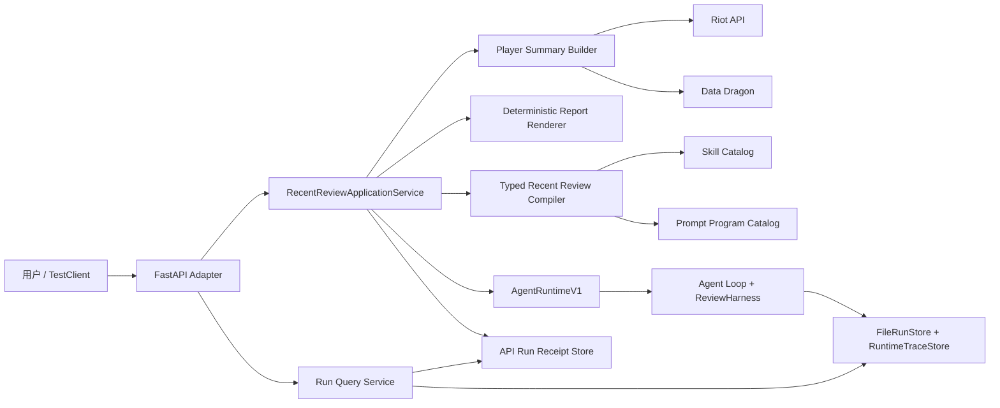

# 5P Prompt Program V1 与早期产品纵向切片设计

## 1. 文档状态

- 日期：2026-08-17
- 当前检查点：`5P-entry-design`
- 结论：接受“版本化 Prompt Program + 薄 FastAPI Adapter + Application Service”方案
- 本批性质：架构、合同与实施顺序设计
- 本批外部 I/O：0；不读取 API Key，不调用 Riot/LLM Provider，不运行 held-out
- 公开证据：提交 `49841ec44832875e65b17770557415113e67b1db`；Actions run
  `31985199623` completed/success

本设计同时处理两个已经存在、不能互相替代的 5P 职责：

1. `Prompt Program V1`：让真实 Prompt/Context/Evaluation/Revision 资产拥有可校验的版本身份；
2. 早期产品纵向切片：把“输入 Riot ID”安全地编译为现有 `AgentRuntimeV1.run()`，再通过
   最小 HTTP 接口返回质量门控后的终态。

它不会把阶段 6 的完整 API、Session、Memory、SQL、SSE、用户隔离或前端提前搬进阶段 5。

## 2. 给初学者的核心解释

### 2.1 为什么不能让 FastAPI 直接调用 Runtime

网页用户能够提供的是：

```text
Riot ID + 最近几局 + 复盘重点
```

但当前 Runtime 要求的是：

```text
已选中的 Skill name/version
+ 已验证的 Player Summary
+ 确定性报告
+ 两个输入 Artifact 的 SHA-256 绑定
+ 从 Skill Manifest 投影出的 Runtime policy
```

这两个对象不是同一个抽象层。HTTP handler 如果自己拉 Riot 数据、生成报告、选择 Skill、
拼 policy、创建 Runtime，就会变成第二个业务编排器；以后 CLI、网页和 MCP 入口会各自复制一套
规则。

因此中间需要 `RecentReviewApplicationService`。FastAPI 只负责 HTTP；Application Service
负责产品用例；AgentRuntime 继续负责 Agent/Harness 执行和最终 Trace。

### 2.2 Prompt Program 是什么

Prompt Program 不是一句“你是英雄联盟教练”。当前一次运行的模型行为同时受以下内容控制：

- `ContextBuilderV1` 的内部信任策略；
- Skill Manifest 和 `SKILL.md`；
- Context 选择、裁剪和角色映射；
- `knowledge.search` 工具合同；
- Evaluation 1.1 的 system prompt、JSON Schema、repair prompt；
- Revision 的 system prompt、修订 prompt 和 validator。

这些资产共同构成一个可执行的 Prompt Program。V1 的目标不是“把文案写得更玄学”，而是让它们
可加载、可版本化、可检测漂移，并让 Runtime Trace 的 prompt identity 对应真实资产。

## 3. 现状审计

### 3.1 已经可以复用

- `build_player_summary()` 已支持依赖注入 RiotClient/DataDragon；
- Summary Schema v1.0、MatchAnalyzer 和 Data Dragon 映射已经存在；
- 确定性 `build_report()` 是可提升到 app 层的纯渲染逻辑；
- `recent-form-review@0.2.0` 已有严格 Pydantic Input/Output、权限、预算和质量门；
- Catalog、ExecutionBoundary、Artifact binding、ContextBuilder、AgentLoop、ToolRuntime、
  ReviewHarness 和 `AgentRuntimeV1.run()` 已存在；
- Runtime 已区分 runtime status 与 publication status，并保存安全 Trace/Usage/Artifact 引用；
- `PromptContextSnapshot` 已实现多类 Prompt 组件的 SHA-256 fingerprint，可提取复用。

### 3.2 仍然缺失

- 没有 `app/api`，也没有 FastAPI/ASGI 依赖；
- 没有 Riot ID 产品请求到 `RuntimeRunRequest` 的 Application Service；
- 没有生产 Runtime composition root；完整装配主要存在于测试和领域实验代码；
- Runtime policy 目前由测试手工构造，没有从 Skill Manifest 投影的产品 compiler；
- `prompt_profile_id/version` 在 Runtime 内硬编码，没有与真实 Prompt 组件绑定；
- 确定性报告仍由 CLI 脚本拥有；
- `RuntimeRunResult` 没有独立持久化查询投影；只有 manifest、Artifact 和 Trace；
- 真实 Provider 当前没有领域质量准入，不能把 API 可调用说成生产 Coach 已上线。

## 4. 功能需求

5P V1 必须做到：

1. 接受严格、有限的近期复盘产品请求；
2. 从 Riot/DataDragon 形成合法 Summary，并生成确定性报告；
3. 由类型化入口可信选择 `recent-form-review`，不再次猜自由文本；
4. 从 Catalog/Manifest 同源生成 Skill version、输入、Artifact binding 和 Runtime policy；
5. 加载并校验 recent-form Prompt Program V1；
6. 通过唯一 `AgentRuntimeV1.run()` 执行，不复制 Agent/Harness；
7. 返回 published/degraded/rejected 或安全 Runtime failure；
8. 使用文件型 receipt/query projection 支持安全读取 run 与最终报告；
9. 提供最小 health endpoint；
10. 使用 Fake Provider 和本地 fixture 完成无外部 I/O 的 HTTP 纵向测试。

## 5. 明确不做

- 不提供 `POST /runs/{run_id}/follow-ups`；
- 不提供单局复盘 HTTP 入口；
- 不提供自由文本对话、澄清或模型 Router fallback；
- 不提供独立 `/status` 轮询端点；
- 不提供后台任务、SSE、Token streaming、cancel/resume 或崩溃恢复；
- 不提供 SQL、Session、Memory、用户账号、鉴权或多租户隔离；
- 不提供 CORS、公共公网绑定或完整前端；
- 不接入 MCP、LangGraph、Pi、Claude Agent SDK、Multi-Agent 或 DAG；
- 不切换默认模型，不重跑 DeepSeek/GLM 真实实验；
- 不因为 Prompt Program 建立而调优 Prompt 文案或宣称真实模型质量通过。

## 6. 三种架构方案比较

### 方案 A：FastAPI handler 直接串联现有脚本

```text
handler -> build_player_summary.py -> generate_markdown_report.py
        -> run_review_harness.py
```

优点是代码最少。缺点是 API 依赖 CLI、重复装配旧 Harness、绕过 AgentRuntime，并让异常、路径、
配置和业务流程全塞进 handler。拒绝。

### 方案 B：把 `RuntimeRunRequest` 原样暴露为通用 HTTP API

优点是 HTTP 层薄。缺点是客户端必须知道 Summary Schema、Skill version、RouterDecision、
Artifact SHA 和 policy；这既泄漏内部合同，也不是“输入 Riot ID”的产品。拒绝。

### 方案 C：薄 Adapter + Application Service + 现有 Runtime

```text
HTTP DTO
  -> RecentReviewApplicationService
  -> Summary/Report domain services
  -> typed Skill/Runtime compiler
  -> Prompt Program validated composition
  -> AgentRuntimeV1.run()
  -> receipt/query projection
  -> HTTP response
```

该方案多一个应用层，但每层职责单一，并能让未来 CLI、网页和 MCP 复用同一用例。接受。

## 7. 高层架构



关键控制原则：FastAPI 不知道 Prompt、Tool 或 Harness；Application Service 不决定发布；
Runtime 不拉 Riot 数据；Harness 仍是唯一发布权。

## 8. 产品请求合同

建议的 V1 请求：

```json
{
  "riot_id": "MIDKING#asd",
  "count": 10,
  "queue": 420,
  "focus": "overall"
}
```

约束：

- `extra="forbid"`；
- `riot_id` 使用单个可显示字段，按最后一个 `#` 拆分并限制总长度/各段长度；
- `count` 为 5—20，默认 10；
- `queue` 只允许 420 或 null，默认 420；
- `focus` 复用 existing enum：overall/laning/survival/economy/vision；
- `min_duration_seconds=300` 是服务器策略，不由客户端修改；
- region 来自部署配置，不接受任意 host/URL；
- 客户端不能提供 run_id、Skill、Provider、Prompt、policy、路径或 Artifact digest。

## 9. 类型化 Skill 编译

`POST /reviews/recent` 已经可靠声明“近期复盘”，因此 compiler 不调用
`DeterministicSkillRouter`。它执行：

1. 从 Catalog 读取精确 `recent-form-review`；
2. 用机器信号 `entrypoint:reviews.recent` 构造 selected `RouterDecision`；
3. `candidate_skills` 只包含该 Skill，evidence 只包含同名正信号，不制造自然语言关键词；
4. 构造 `RecentFormReviewInput`；
5. 服务器生成安全 run_id；
6. 由真实内容生成 `SkillInputArtifactBinding`；
7. 从 Manifest 投影 Runtime policy；
8. 交给 Runtime 后仍由 `SkillExecutionBoundary` 重新验证全部身份和摘要。

`user_utterance` 在当前合同中必须非空。V1 使用服务器生成的审计描述，例如
`typed-entrypoint reviews.recent focus=survival`。它只作为 data-only request context，绝不重新路由，
也不伪装成用户原话。

## 10. Prompt Program V1

### 10.1 合同

每个 program manifest 至少声明：

```text
schema_version
program_id
program_version
skill_name / skill_version
context_contract_id / version
evaluation_contract_id / version
component_fingerprints[]
```

组件 fingerprint 复用现有 `PromptContextSnapshot` 的规范编码和 SHA-256 逻辑，覆盖：

- Skill manifest 与 instructions；
- Context contract descriptor；
- knowledge.search contract；
- secure Evaluation 1.1 schema、system/user/repair；
- fact-pack builder probe；
- Revision system/user probe 与 validator identity。

### 10.2 加载与漂移

- Program Catalog 启动时严格加载 manifest；
- 重新计算当前源码/资产 fingerprint；
- 任一组件变动但 program version/digest 未更新时 fail closed；
- program 必须与 selected Skill name/version 和 Context contract 相符；
- product composition 只允许 Evaluation 1.1 安全组合；
- 实验 case-context snapshot 保持原职责，不直接当作 product manifest。

### 10.3 Runtime provenance

移除 production path 对 `<skill>-coach@1.0.0` 硬编码的依赖。Runtime 从已验证 program resolver
获得 `prompt_profile_id/version` 写入 identity；旧测试/非产品调用可通过显式 legacy resolver
兼容，但不能静默冒充产品 program。

## 11. Application Service 数据流

```text
1. 验证 HTTP 产品请求
2. 调 Summary Builder 拉 Riot/DataDragon
3. 验证 Summary Schema，要求至少一场可分析比赛
4. 用 app-level renderer 生成确定性报告
5. 编译 typed Skill/Runtime request
6. 调 AgentRuntimeV1.run()
7. 写 body-free API run receipt
8. 映射 typed terminal response
```

run_id 在 Summary/报告成功后、Runtime 编译前生成。前置 Riot/DataDragon 失败不会伪造一个
Harness run；只返回安全 request error。Runtime 一旦开始，成功或失败均尽量形成 Trace 与 receipt。

## 12. 生产 composition root

composition root 是唯一知道基础设施具体类的地方，长生命周期创建：

- SkillCatalog；
- PromptProgramCatalog；
- LocalHybridKnowledgeProvider；
- DataDragonService；
- Provider（通过现有 Provider 配置/Registry，不在 import 时读取 Key）；
- `RuntimeExecutionFactory`；
- secure evaluator factory 与 bounded reviser factory；
- AgentRuntimeV1；
- Application Service 和 Query Service；
- FastAPI app。

测试直接注入 Fake Summary Builder/Fake Provider/临时 runs root。模块 import、OpenAPI 生成和 CI
不得读取 Key或发起网络请求。

## 13. 文件型 run 查询投影

同步 POST 已返回终态，但旧路线还要求复用持久化 run/report。V1 增加一个 body-free、不可覆盖的
`api_run_receipt.json`，至少保存：

- schema version 与 run_id；
- Runtime status、publication status、terminal reason；
- Runtime 返回的 Trace reference（允许 null）；
- receipt 创建时间；
- 是否存在 final-report 的安全提示，不保存报告正文。

`RunQueryService` 的读取顺序：

1. 校验 run_id；
2. 严格读取 receipt；
3. 若有 Trace reference，调用 `RuntimeTraceStore.read_trace()` 验 SHA 与 Schema；
4. 读取 Harness manifest，并交叉检查 publication；
5. 报告请求只选择唯一 `final_report` record，再用 `FileRunStore.read_artifact()` 验摘要；
6. 返回 allowlisted DTO 或 Markdown bytes。

receipt 是阶段 5 的文件型查询投影，不是 SQL、事件日志或恢复系统。进程在 Trace 后、receipt 前
崩溃会留下不可查询的孤立 run；阶段 6/8 才解决事务、扫描恢复和持久任务模型。

## 14. HTTP API V1

### `POST /reviews/recent`

- 成功创建并完成 Runtime：`201 Created`；
- body 返回 run_id、runtime/publication status、terminal reason、typed Skill output 和 links；
- published/degraded output 必须有 report；rejected 不得有 report；
- Runtime 安全失败返回错误 envelope，可包含可查询 run_id，但不返回草稿或异常正文。

### `GET /runs/{run_id}`

返回安全 run view：

- run/runtime/publication/terminal；
- Skill 与 Prompt Program identity；
- started/completed/elapsed；
- completeness-aware Usage；
- `report_available`；
- 不返回 Prompt、Context、Tool data、原始异常或 Artifact 本地路径。

### `GET /runs/{run_id}/report`

- published/degraded：`200 text/markdown; charset=utf-8`；
- rejected/无 final Artifact：`409 report_not_available`；
- run 不存在：404；
- 摘要/Schema 不一致：500 `run_integrity_failed`，不返回损坏正文。

### `GET /health`

只做 liveness，返回 API/schema 版本。它不读取 Key、不探测 Riot/LLM、不泄露模型、路径或环境。

### 本轮排除端点

- `/runs/{run_id}/status`：同步 V1 中与 run view 重复；
- `/runs/{run_id}/follow-ups`：需要阶段 6 Session/Memory/澄清合同。

## 15. 安全错误映射

| 来源 | 安全 API code | HTTP | 说明 |
|---|---|---:|---|
| 请求 Schema/Riot ID | `request_invalid` | 422 | 不进入数据或 Runtime |
| Riot 账号不存在 | `player_not_found` | 404 | 不返回上游 body |
| Riot server key 失效 | `riot_authentication_failed` | 503 | 不是客户端 401 |
| Riot 限流 | `riot_rate_limited` | 503 | 可返回受控 Retry-After |
| Riot/DataDragon 超时 | `upstream_timeout` | 504 | 不返回 URL/异常正文 |
| 上游 5xx/连接失败 | `upstream_unavailable` | 503 | 可重试但 V1 不自动后台重试 |
| 无可分析比赛 | `insufficient_match_data` | 422 | 不消耗模型 |
| Catalog/Prompt/配置漂移 | `service_configuration_invalid` | 503 | fail closed |
| Runtime failed | `review_runtime_failed` | 500 | 保留安全 run_id/reason |
| receipt/Trace/Artifact 损坏 | `run_integrity_failed` | 500 | 不返回损坏内容 |
| run 不存在 | `run_not_found` | 404 | 通用信息 |

当前 summary 内部仍可能保存局部 `str(error)` 供本地诊断；API DTO 和 Trace 均不得透传这些字段。

## 16. 非功能需求与限制

### 安全

- 默认仅绑定 `127.0.0.1`；没有鉴权/限流前不得公开绑定公网；
- 不启用宽泛 CORS；
- `.env` 不提交，Key 不进入响应、Trace、receipt 或日志；
- 客户端无法提供 URL、文件路径、run_id、Skill、Provider 或 policy；
- 所有公开错误均为 allowlisted code/message。

### 性能与容量

- V1 同步阻塞；Riot/DataDragon + Agent + Evaluation 延迟相加；
- count 最大 20；DataDragon 为长生命周期缓存服务；
- 首批默认单进程、单 worker、受控并发，不声明 p50/p95、RPS 或可用性 SLO；
- SSE、后台队列、水平扩容和多 worker 文件一致性留到阶段 6/8。

### 可靠性

- RiotClient 有请求 timeout；首批 safe mapper 不夸大为完整 Tool Runtime 重试/熔断；
- final Artifact 和 Trace 保持不可变/摘要校验；
- receipt 只写一次；无幂等、事务和崩溃恢复承诺；
- 部分 timeline/detail 失败可形成带边界的 Summary，但零可分析比赛在模型前拒绝。
- component fingerprint 是可重复的语义漂移门，不是两个程序行为完全等价的形式化证明；
- 文件摘要能发现应用读取路径中的单文件不一致，但不防拥有本机写权限的攻击者同时重写正文与
  全部元数据；公网多用户完整性与审计根属于后续持久存储设计。

### 可维护性

- handler、Application Service、domain services、compiler、composition、query store 分层测试；
- CLI 逐步改为复用 app-level renderer/builder，不由 API 导入 scripts；
- Prompt 资产变更必须显式升级 program identity 并通过漂移测试。

## 17. 测试矩阵

### 5P-1 合同/Compiler

- 产品请求合法/额外字段/边界值；
- typed endpoint 信号，不调用 Router；
- Catalog 缺失、version drift、evidence mismatch；
- Manifest → Runtime policy 全字段一致；
- Artifact bytes/digest 篡改；
- run_id 仅服务器生成。

### 5P-2 Prompt Program/Composition

- program manifest 严格加载；
- 任一组件内容、Skill version、Evaluation contract 漂移即拒绝；
- Runtime identity 与 validated program 一致；
- composition 使用 Secure Evaluation 1.1；
- import/app factory 不读取 Key、不网络 I/O；
- Fake Provider + 真实 RAG + Runtime 纵向装配。

### 5P-3 Domain/Application Service

- CLI/app renderer 输出逐字节一致；
- Riot 404/401/429/timeout/5xx 安全映射；
- timeline/detail 部分失败与零有效比赛；
- published/degraded/rejected/Runtime failed 映射；
- 原始异常、URL、Key 和内部路径不进入 DTO。

### 5P-4 Receipt/Query

- immutable receipt；
- run_id traversal/absolute path 拒绝；
- Trace reference SHA/Schema mismatch；
- manifest/publication 交叉不一致；
- final report digest mismatch；
- rejected 不暴露报告；
- crash gap 明确为不可恢复限制。

### 5P-5 FastAPI

- OpenAPI/请求/响应严格合同；
- POST/GET/report/health 正常与错误路径；
- 无 `/status`、follow-up、单局、SSE；
- TestClient 纵向切片使用 Fake Provider、本地 fixture、真实 Catalog/RAG/Runtime/Harness；
- CI 不读取 `.env`、不调用 Riot/LLM。

### 5P-6 Exit

- focused + proportional + full pytest；
- 两套 RAG、compileall、Harness boundary、secret/tracked-data、governance、diff；
- exact-SHA public CI；
- 初学者教学验收和已知限制复读；
- 不把 Fake Provider/API 接线说成真实模型质量或生产部署。

## 18. 5P 固定子阶段

```text
5P-entry-design  本文与 ADR-0032/0033
5P-1             Product Request & Typed Skill/Runtime Compiler
5P-2             Prompt Program V1 & Runtime Composition Root
5P-3             Domain Pipeline Promotion & Application Service
5P-4             File-backed Run Receipt & Query Projection
5P-5             Thin FastAPI Adapter & No-I/O Vertical Slice
5P-6             Product Slice Evaluation & Exit Review
```

每项单独教学、TDD、状态更新和公开验证；实现提前覆盖后项也不能跳过原检查点。

## 19. 参考项目怎样被吸收

- EchoMind：只吸收薄 API、会话边界意识和可靠工具思想；5P 不迁移其 Memory 或伪 MCP；
- AGI-Saber：只参考 composition/runtime 分层和后续任务恢复思路；不引入 DAG/重基础设施；
- Sea/OpenResearch：只保留研究证据与多 Agent 边界参考；5P 无多 Agent 需求；
- Pi/Claude Agent SDK：仍属于 5F 的同切片对照，不进入本设计实现。

## 20. 本设计完成后的唯一下一步

`5P-1 Product Request & Typed Skill/Runtime Compiler`。它只写产品合同、可信 typed selection、
Artifact binding 和 Manifest-derived policy 的本地 TDD；不安装 FastAPI、不读取 Key、不调用 Riot/
LLM、不实现 Prompt Program 或 HTTP。
